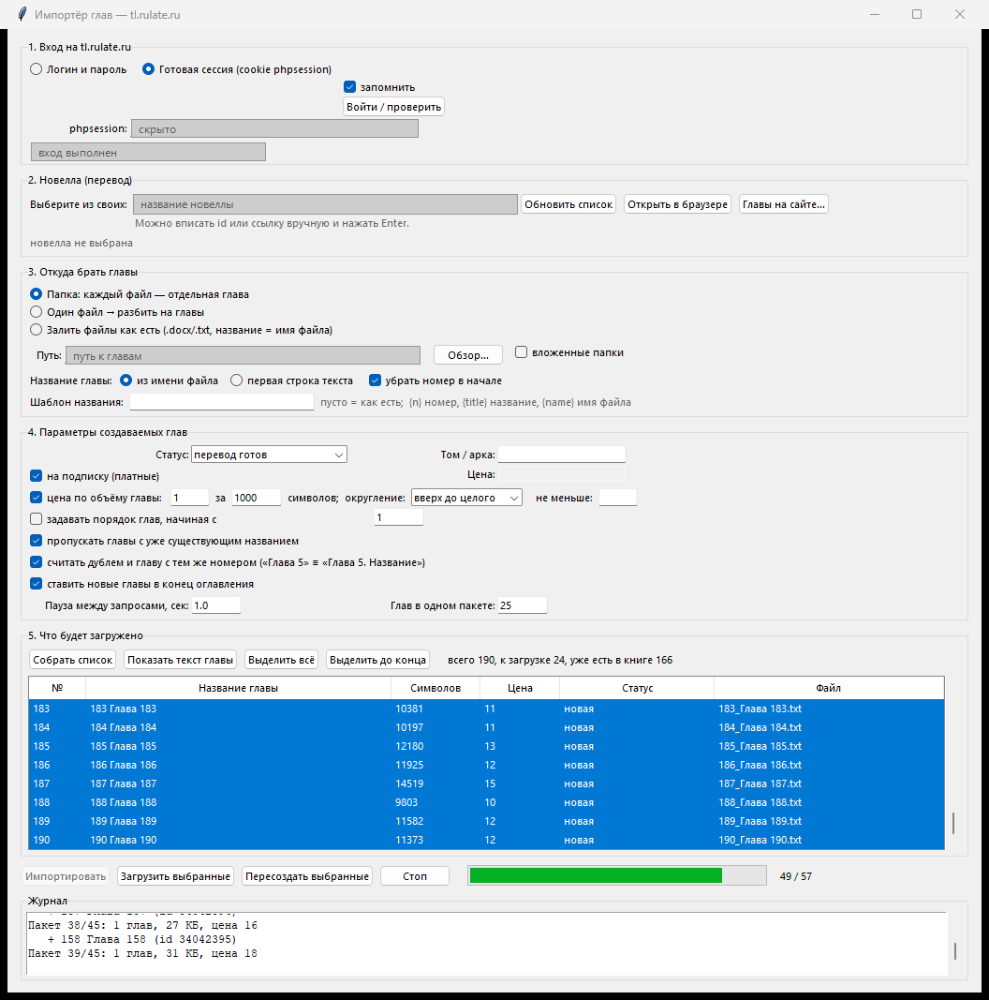

  

  <b>Заливает сотни глав на tl.rulate.ru, пока закипает чайник.</b> 
  Цена считается из объёма текста. Дубли ловятся сами. 
  Названия и цены уже залитых глав правятся пачкой.

  
  
  
  

  

---

  

---

## 💡 Зачем это

Заливать главы руками — это открыть форму, вставить текст, придумать название,
выставить цену, нажать «сохранить». И так двести раз. Chapter Cannon делает всю
пачку за один заход: берёт папку с файлами, превращает каждый файл в главу,
сам считает цену по объёму текста, пропускает то, что уже есть на сайте, и
складывает новые главы в конец оглавления.

> Программа работает от вашего аккаунта и делает ровно то, что вы сделали бы
> руками — только быстрее и без опечаток.

---

## ⚙️ Что умеет

### 📥 Три способа залить главы

| Режим | Как работает |
|---|---|
| **Папка → главы** | каждый файл в папке становится отдельной главой. Файлы сортируются по-человечески: `глава 2` идёт перед `глава 10`, а не наоборот. Можно искать и во вложенных папках |
| **Один файл → главы** | большой текст режется на главы по строкам-заголовкам. Из коробки ловит «Глава 12», «Chapter 3», «Часть 2», «Пролог», «Эпилог». Правило распознавания настраивается. Всё, что идёт до первого заголовка, отбрасывается |
| **Залить как есть** | `.docx` и `.txt` уходят на сайт без обработки, название главы = имя файла. Для случая, когда файлы уже подготовлены как надо |

Понимает `.txt` `.md` `.docx` `.fb2` `.html`. Кодировка определяется сама —
utf-8, cp1251, koi8-r, cp866, так что старые файлы из «Блокнота» тоже подойдут.

### 💰 Цена по объёму текста

Главная фишка. Вместо одной цены на всё указываете правило — например
**1 за каждую 1000 символов** — и каждая глава получает свою цену:

| Объём главы | Цена при 1 / 1000 |
|---|---|
| 105 000 символов | **105** |
| 14 519 символов | **15** |
| 9 803 символа | **10** |
| 2 400 символов | **3** |

Настраивается всё: ставка, размер блока символов, округление
(**вверх до целого**, **до ближайшего**, **точно до сотых**) и нижняя граница
цены — чтобы короткая глава не ушла за бесценок. Цены видны в таблице
предпросмотра **до** отправки, вместе с суммой по всей пачке.

Никакой цены по объёму не нужно? Поставьте одну цену на все главы или залейте
бесплатно — как обычно.

### 🔍 Дубли не пролезут

Перед заливкой программа сама скачивает оглавление вашей новеллы и сверяет с
ним всё, что собирается отправить:

* **по названию** — с поправкой на регистр, «ё», лишние пробелы и знаки;
* **по номеру главы** — «Глава 5» в файле и «Глава 5. Пробуждение» на сайте
  считаются одной и той же главой.

Совпадения подсвечиваются в списке, выписываются в журнал отдельным перечнем
(«уже есть в книге: 166») и по умолчанию пропускаются. Захотите залить поверх —
снимите галочку, программа честно предупредит, что появятся повторы.

### 🎯 Заливка выборочно

* Shift и Ctrl в списке — как в проводнике.
* **«Выделить до конца»** — щёлкнули главу, и выделилось всё от неё до конца.
  Это и есть «залей, начиная с 137-й».
* **«Загрузить выбранные»** — отправляет только отмеченное.
* **«Пересоздать выбранные»** — удаляет эти главы на сайте и заливает заново.
  Спасает, когда залили не тот текст или кривые названия.
* **«Стоп»** — останавливает после текущей пачки, ничего не ломая.

### ✏️ Правка уже залитых глав

Отдельное окно со списком всех глав новеллы. Выделяете нужные и:

| Действие | Что происходит |
|---|---|
| **Прочитать объём и цену** | подтягивает с сайта, сколько в главе символов, платная ли она и почём |
| **Переименовать** | замена куска текста в названии или приведение к единому шаблону |
| **Цена** | одна цена на все выбранные, пересчёт по объёму каждой главы или снятие платности |
| **Удалить** | убирает выбранные главы с сайта |

Шаблон переименования собирается из подстановок:

| Подстановка | Что подставит |
|---|---|
| `{n}` | номер из названия главы: «Глава 5» → 5 |
| `{i}` | порядковый номер в выделении, отсчёт с любого числа |
| `{title}` | название целиком, как есть |
| `{rest}` | название без «Глава N»: «Глава 5. Пробуждение» → «Пробуждение» |

Пример: шаблон `Глава {n}. {rest}` причешет разнобой вроде «гл. 5 пробуждение»,
«Chapter 5 - Awakening», «5. Пробуждение» к одному виду. Главы без номера
(«Пролог», «Экстра») шаблон не трогает. **Перед отправкой показывается список
«старое → новое»** — видно, что получится, и можно передумать.

### 🧩 Структура и порядок

* **Статус глав** — «идёт перевод», «редактируется», «перевод готов».
* **Том / арка** — проставляется всей пачке разом.
* **Порядок глав** — можно задать сквозную нумерацию, начиная с любого числа.
* **В конец оглавления** — после заливки новые главы переставляются в хвост
  книги, чтобы не перемешались с уже существующими.

### 🛟 Мелочи, которые бесят, когда их нет

* Список ваших переводов подтягивается кнопкой — не надо искать id вручную.
* Ссылку на новеллу можно просто вставить целиком.
* Предпросмотр текста любой главы двойным щелчком — до отправки.
* Живой журнал: видно каждую созданную главу, её id и цену.
* Прогресс-бар и счётчик «сколько из скольких».
* Пауза между запросами — чтобы не долбить сайт очередью.
* Все настройки запоминаются до следующего запуска.
* Кнопка «Открыть в браузере» — сразу к своей новелле.

---

## 📦 Установка

<table>
<tr><td width="60" align="center">1️⃣</td><td>Откройте вкладку <a href="../../releases/latest"><b>Releases</b></a></td></tr>
<tr><td align="center">2️⃣</td><td>Скачайте <code>rulate-importer.exe</code></td></tr>
<tr><td align="center">3️⃣</td><td>Положите в любую папку и запустите двойным щелчком</td></tr>
</table>

Ни Python, ни библиотек, ни установщика — всё внутри одного файла. Рядом с exe
ничего не создаётся, настройки лежат в `%APPDATA%\rulate_importer\config.json`.

> Исходный код пока закрыт — в репозитории только готовая сборка.

---

## 🛡️ Проверка файла

`rulate-importer.exe` — самораспаковывающаяся сборка. Сверьте хэш скачанного
файла с тем, что указан здесь:

<table>
<tr><td><b>SHA-256</b></td><td><code>0bad3020fe7e020bfaf3b4a11c34764ef31ee541c17a57baff60d63af0d3d5ac</code></td></tr>
<tr><td><b>Размер</b></td><td>19 125 722 байта</td></tr>
<tr><td><b>Отчёт</b></td><td><a href="https://www.virustotal.com/gui/file/0bad3020fe7e020bfaf3b4a11c34764ef31ee541c17a57baff60d63af0d3d5ac">VirusTotal</a></td></tr>
</table>

Проверить у себя — правый клик по файлу → «Открыть в терминале» и команда
`Get-FileHash .\rulate-importer.exe -Algorithm SHA256`. Совпал — файл тот самый.

<b>Антивирус ругается — это нормально?</b>

 

Иногда да. Программы, упакованные в один exe, антивирусы порой помечают
эвристикой — срабатывание идёт на способ упаковки, а не на содержимое.
Выглядит это как одиночные детекты вида «Generic», «Trojan.Gen», «Wacatac» на
фоне полусотни чистых вердиктов. Ориентируйтесь на общую картину в отчёте и на
совпадение хэша.

---

## 📖 Как пользоваться: куда что вставлять

<b>Шаг 1 — Вход на tl.rulate.ru</b>

 

Наверху окна два способа входа, переключаются кружками.

**Логин и пароль** — надёжнее. Вписываете те же данные, что и на сайте,
жмёте «Войти / проверить». Под кнопкой появится «вход выполнен: ваш_ник».

**Готовая сессия (cookie phpsession)** — если не хотите вводить пароль:

1. Откройте tl.rulate.ru в браузере и войдите в свой аккаунт.
2. Нажмите `F12` — откроются инструменты разработчика.
3. Вкладка **Application** (в Firefox — **Хранилище**).
4. Слева разверните **Cookies** и выберите `https://tl.rulate.ru`.
5. Найдите строку с именем `phpsession` и скопируйте её **значение** —
   длинную строку из букв и цифр.
6. Вставьте эту строку в поле **phpsession** в программе.
7. Нажмите «Войти / проверить».

Галочка «запомнить» сохранит сессию до следующего запуска. Учтите: сессия живёт
недолго и протухает — тогда достаточно взять её заново или войти по паролю.

<b>Шаг 2 — Выбор новеллы</b>

 

Блок «Новелла (перевод)». Три способа указать книгу:

* **Из списка** — нажмите «Обновить список», и в выпадающем меню появятся все
  ваши переводы с числом глав. Выберите нужный.
* **Ссылкой** — вставьте `https://tl.rulate.ru/book/196905` в то же поле и
  нажмите `Enter`.
* **По id** — просто `196905` и `Enter`.

Программа покажет название новеллы, сколько в ней глав и есть ли у вас права на
правку. Если написано «НЕТ прав на редактирование» — сайт отклонит загрузку,
выберите свой перевод.

<b>Шаг 3 — Откуда брать главы</b>

 

Выберите один из трёх режимов и укажите путь кнопкой «Обзор…».

**Папка: каждый файл — отдельная глава.** Указываете папку с файлами. Галочка
«вложенные папки» — искать и в подпапках. Название главы берётся либо из имени
файла, либо из первой строки текста — переключатель «Название главы». Галочка
«убрать номер в начале» отрежет ведущий номер из имени файла, если он там
служебный.

**Один файл → разбить на главы.** Указываете один большой файл. Правило поиска
заголовков можно поменять, кнопка «по умолчанию» вернёт стандартное.

**Залить файлы как есть.** Указываете папку с `.docx/.txt`. За один запрос сайт
принимает до 20 файлов, программа сама режет на партии.

**Шаблон названия** (необязательно) — если хотите привести названия к одному
виду прямо при заливке. Пусто = оставить как есть.

<b>Шаг 4 — Параметры глав</b>

 

* **Статус** — с каким статусом создавать главы.
* **Том / арка** — если ведёте книгу томами.
* **На подписку (платные)** и **Цена** — одна цена на все главы.
* **Цена по объёму главы** — вместо фиксированной: ставка, размер блока
  символов, округление и нижняя граница. Работает вместе с «на подписку»;
  при включении поле обычной цены гаснет.
* **Задавать порядок глав** — сквозная нумерация с указанного числа.
* **Пропускать главы с уже существующим названием** — защита от повторов.
* **Считать дублем и главу с тем же номером** — ловит «Глава 5» ≡
  «Глава 5. Название».
* **Ставить новые главы в конец оглавления** — рекомендуется оставить.
* **Пауза между запросами** — 1 секунда по умолчанию.
* **Глав в одном пакете** — 25 по умолчанию, этого хватает почти всегда.

<b>Шаг 5 — Предпросмотр</b>

 

Кнопка **«Собрать список»** соберёт таблицу: номер, название, сколько символов,
какая будет цена, статус («новая» или «уже есть в книге») и файл-источник.
Снизу счётчик: сколько всего, сколько к загрузке, сколько уже есть на сайте.

Двойной щелчок по строке (или кнопка «Показать текст главы») открывает текст —
удобно убедиться, что кодировка не поехала и глава не пустая.

Совпадения с сайтом выписываются в журнал списком, с указанием, как глава
называется на сайте.

<b>Шаг 6 — Заливка</b>

 

* **«Импортировать»** — весь список.
* **«Загрузить выбранные»** — только выделенные строки.
* **«Пересоздать выбранные»** — удалить на сайте и залить заново.

Перед стартом появится окно с итогом: сколько глав будет создано, сколько
пропущено, какие цены получатся и на какую сумму. Отменить можно там же.

Дальше идёт прогресс, а в журнале видно каждую созданную главу с её id и ценой.
Кнопка **«Стоп»** аккуратно останавливает после текущей пачки.

<b>Правка уже залитых глав</b>

 

Кнопка **«Главы на сайте…»** рядом с выбором новеллы.

Откроется список всех глав книги. Выделите нужные — Shift и Ctrl работают, есть
«Выделить всё» и «Выделить до конца». Дальше:

* **«Прочитать объём и цену»** — подтянет данные с сайта. Каждая глава читается
  отдельным запросом, так что на большой книге это займёт время; программа
  предупредит, если выбрано больше двадцати.
* **«Переименовать…»** — замена куска текста (можно регулярным выражением) и/или
  шаблон названия. Перед применением покажет список «старое → новое».
* **«Цена…»** — одна цена, пересчёт по объёму или снятие платности.
* **«Удалить выбранные»** — с подтверждением.

---

## ⚠️ О чём стоит помнить

| | |
|---|---|
| 🗑️ **Удаление необратимо** | и «Пересоздать выбранные», и «Удалить выбранные» стирают главы с сайта навсегда |
| 🐢 **Не гоните** | пауза между запросами стоит не просто так; уменьшать её ради скорости — плохая идея |
| 💸 **Цена — одна на запрос** | при расчёте по объёму главы группируются по цене, поэтому запросов выходит больше, чем при одной общей цене. Это нормально, просто дольше |
| 👤 **Права** | заливать можно только в свои переводы; чужие сайт отклонит |
| ✏️ **Правка готовых глав** | делайте первый заход на одной ненужной главе — убедитесь, что результат вас устраивает |

---

## 💬 Поддержка

  

Вопросы, баги, идеи и «а можно ещё вот так?» — пишите. 
Если что-то сломалось, приложите текст из <b>«Журнала»</b> внизу окна: 
по нему сразу видно, на каком шаге всё встало.

